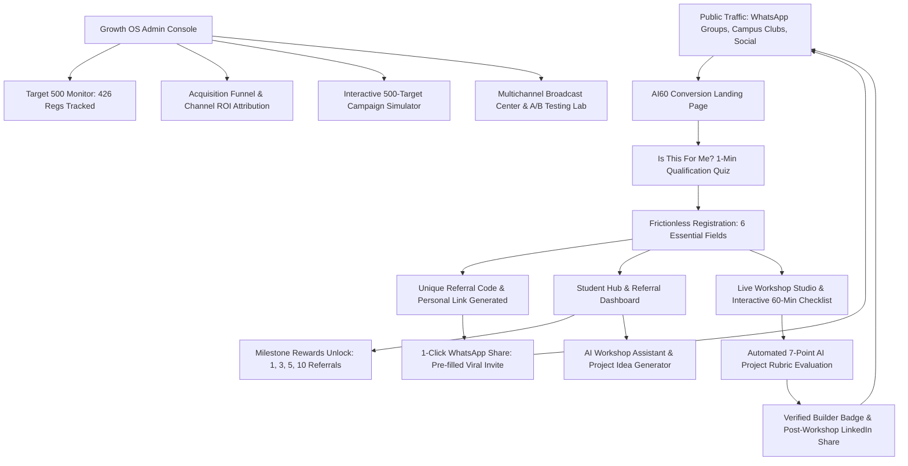

# AI60 Growth Engine — Turn One Registration Into a Viral Growth Loop

[](https://nxtwave.tech)
[](LICENSE)
[](https://nodejs.org)
[-orange.svg)](https://sql.js.org)

> **Submission for NxtWave Growth Intern Challenge**  
> **Challenge Goal:** Acquire **500 final-year engineering students** to register for *"Build Your First AI Project in 60 Minutes"* in **7 days** with a **₹2,000 budget**.

---

## 🎯 Executive Summary

Acquiring 500 engineering students on a ₹2,000 budget is impossible via traditional paid ads (which would demand a CAC under ₹4 in a market where tech ad CAC exceeds ₹50).  

The **AI60 Growth Engine** solves this by turning every registered student into an active acquisition node through **incentivized peer referral loops**, **campus club partnerships**, and **departmental WhatsApp distribution**, backed by a full-stack **Growth Operating System**.

---

## 🏗️ System Architecture



---

## ✨ Core Working Assets

### 1. High-Converting Landing Page (`/#landing`)
* **Time-Boxed Value Proposition:** *"Build Your First AI Project in 60 Minutes"*.
* **Interactive 5-Step Pipeline Visual:** Idea → Build → Connect → Test → Demo (No generic stock photos).
* **Live Scarcity Meter:** Real-time counter showing **426 / 500 Spots Reserved (85.2%)**, with only 74 seats remaining.
* **Campus Social Proof:** 30+ engineering colleges actively participating.

### 2. "Is This For Me?" Qualification Quiz (`/#quiz`)
* 5 interactive multiple-choice questions assessing AI exposure, branch, and goals.
* Calculates dynamic **Workshop Match Score (e.g., 94% Match)** to dissolve student self-doubt before registration.

### 3. Student Hub & Viral Referral Console (`/#student`)
* Personalized referral link (`?ref=CODE`) and 1-click WhatsApp share button.
* **Milestone Unlock Progress:**
  * 1 Referral: AI Prompt Engineering Cheat Sheet.
  * 3 Referrals: 5 Tested GitHub Starter Repositories.
  * 5 Referrals: Priority 1-on-1 Code Review by Mentors.
  * 10 Referrals: Campus Growth Ambassador Hall of Fame.
* **Campus & Global Leaderboards:** Rank, verified signups, and badges.
* **AI Workshop Assistant:** Grounded chat assistant answering questions with approved workshop knowledge.
* **AI Project Idea Generator:** Custom 60-minute MVP blueprints for student branches.

### 4. Interactive Live Workshop Studio (`/#workshop`)
* Simulated live video stream stage with attendee counter (384 concurrent).
* Checkable 60-minute milestone checklist tracking attendance in the database.
* Live student Q&A feed simulation.

### 5. Automated AI Project Evaluation Rubric (`/#submit`)
* Evaluates submitted projects across **7 dimensions**: Problem Clarity, AI Integration, Functionality, UX Design, Originality, Technical Implementation, and Completeness.
* Generates verifiable digital builder badges with 1-click LinkedIn/WhatsApp share triggers to fuel post-workshop growth loops.

### 6. Admin Growth Operating System (`/#admin`)
* **Target 500 Monitor:** Tracks velocity toward 500 signups (426 seeded registrations).
* **End-to-End Funnel:** Visitors (4,120) → Quiz (1,840) → Registered (426) → Referrals (149) → Attendees (384).
* **Channel Attribution:** College Clubs (142), WhatsApp (88), Viral Referrals (149), Organic (28), Meta Ads (19).
* **Interactive Campaign Simulator:** Sliders for clubs, WhatsApp groups, viral coefficient, and ₹2,000 budget to project registration probability.
* **AI Growth Copilot:** Diagnostic recommendations citing active metrics.
* **Multichannel Broadcast Center:** WhatsApp message templates with audience filtering.
* **A/B Testing Suite:** Live headline and CTA experiments with statistical confidence tracking.

### 7. 5-Slide Strategy Presentation (`/#strategy`)
* Interactive in-app deck covering Student Friction, Channel Ranking, Mathematical Model, Working Assets, and Human vs AI reflections.

---

## 📊 The 500-Registration Mathematical Model

$$\text{Projected Regs} = \text{Clubs (160)} + \text{WhatsApp (111)} + \text{Referrals (149)} + \text{Organic (50)} + \text{Paid Ads (30)} = \mathbf{500+}$$

* **Budget:** ₹2,000
* **Total Registrations:** 508
* **Blended Cost per Registration:** **₹3.94** (Well under ₹2,000 budget)
* **Viral Coefficient ($K$):** 0.35 (35% of all signups generated by peer referrals)

---

## 🚀 Quick Start Guide

### Prerequisites
* Node.js v18 or higher
* npm

### Installation & Run

1. Clone or navigate to the directory:
   ```bash
   cd scratch/ai60-growth-engine
   ```

2. Install dependencies:
   ```bash
   npm install
   ```

3. Seed the realistic demo database (426 registrations, 149 referrals, 8 ambassadors, 3 experiments):
   ```bash
   npm run seed
   ```

4. Launch the application:
   ```bash
   npm start
   ```

5. Open in your browser:
   * **Public Landing Page:** [http://localhost:3000/](http://localhost:3000/)
   * **Admin Growth OS:** [http://localhost:3000/#admin](http://localhost:3000/#admin)
   * **5-Slide Strategy Deck:** [http://localhost:3000/#strategy](http://localhost:3000/#strategy)

### Demo Credentials
* **Admin Email:** `admin@ai60.demo`
* **Admin Password:** `admin123`

---

## 📁 Repository Structure

```
ai60-growth-engine/
├── data/
│   └── ai60.db              # SQLite pure JS database
├── public/
│   ├── css/
│   │   └── style.css        # Premium dark mode SaaS design system
│   ├── js/
│   │   └── app.js           # Client SPA application logic & router
│   └── index.html           # Single-page web application shell
├── submission/
│   ├── growth-plan.md       # 5-Slide Growth Master Plan
│   ├── ai-learning-notes.md # 3 Detailed AI Reflections (Human vs AI)
│   └── video-script.md      # 3-Minute Video Recording Script
├── database.js              # SQLite schema, tables & indexes
├── seed.js                  # Seed script generating 426 realistic records
├── server.js                # Express API backend & static file server
├── package.json
└── README.md
```

---

## 🧪 Simulation & Safety Compliance
* **No Real Student Contact:** All student profiles, phone numbers, and emails are simulated demo data.
* **Deterministic AI Safety:** When external LLM API credentials are not provided, the system seamlessly operates in `DEMO_AI_MODE=true` using an approved, grounded workshop knowledge base.
* **Safe Messaging:** Simulated WhatsApp queues prevent accidental external API dispatches without explicit production credentials.
